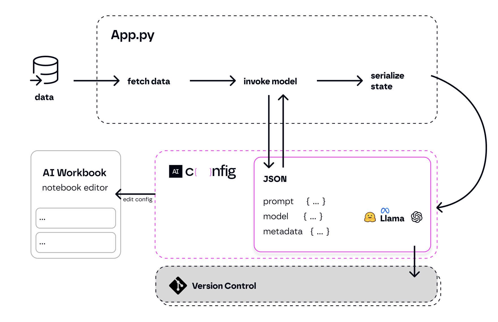

<div align="center"><picture>
  
</picture></div>
<br/>


[)](https://discord.gg/qMqgzDae)


> Full documentation: **[aiconfig.lastmileai.dev](https://aiconfig.lastmileai.dev/)**

## Overview

AIConfig saves prompts, models and model parameters as source control friendly configs. This allows you to iterate on prompts and model parameters _separately from your application code_.

1. **Prompts as configs**: a [standardized JSON format](https://aiconfig.lastmileai.dev/docs/overview/ai-config-format) to store generative AI model settings, prompt inputs/outputs, and flexible metadata.
2. **Model-agnostic SDK**: Python & Node SDKs to use `aiconfig` in your application code. AIConfig is designed to be **model-agnostic** and **multi-modal**, so you can extend it to work with any generative AI model, including text, image and audio.
3. **AI Workbook editor**: A [notebook-like playground](https://lastmileai.dev/workbooks/clooqs3p200kkpe53u6n2rhr9) to edit `aiconfig` files visually, run prompts, tweak models and model settings, and chain things together.

### What problem it solves

Today, application code is tightly coupled with the gen AI settings for the application -- prompts, parameters, and model-specific logic is all jumbled in with app code.

- results in increased complexity
- makes it hard to iterate on the prompts or try different models easily
- makes it hard to evaluate prompt/model performance

AIConfig helps unwind complexity by separating prompts, model parameters, and model-specific logic from your application.

- simplifies application code -- simply call `config.run()`
- open the `aiconfig` in a playground to iterate quickly
- version control and evaluate the `aiconfig` - it's the AI artifact for your application.



### Quicknav

<ul style="margin-bottom:0; padding-bottom:0;">
  <li><a href="#install">Getting Started</a></li>
  <ul style="margin-bottom:0; padding-bottom:0;">
    <li><a href="https://aiconfig.lastmileai.dev/docs/overview/create-an-aiconfig">Create an AIConfig</a></li>
    <li><a href="https://aiconfig.lastmileai.dev/docs/overview/run-aiconfig">Run a prompt</a></li>
    <li><a href="https://aiconfig.lastmileai.dev/docs/overview/parameters">Pass data into prompts</a></li>
    <li><a href="https://aiconfig.lastmileai.dev/docs/overview/define-prompt-chain">Prompt Chains</a></li>
    <li><a href="https://aiconfig.lastmileai.dev/docs/overview/monitoring-aiconfig">Callbacks and monitoring</a></li>
  </ul>
  <li><a href="#aiconfig-sdk">SDK Cheatsheet</a></li>
  <li><a href="#cookbooks">Cookbooks and guides</a></li>
  <ul style="margin-bottom:0; padding-bottom:0;">
    <li><a href="https://github.com/lastmile-ai/aiconfig/tree/main/cookbooks/Wizard-GPT">CLI Chatbot</a></li>
    <li><a href="https://github.com/lastmile-ai/aiconfig/tree/main/cookbooks/RAG-with-AIConfig">RAG with AIConfig</a></li>
    <li><a href="https://github.com/lastmile-ai/aiconfig/tree/main/cookbooks/Basic-Prompt-Routing">Prompt routing</a></li>
    <li><a href="https://github.com/lastmile-ai/aiconfig/tree/main/cookbooks/Function-Calling-OpenAI">OpenAI function calling</a></li>
    <li><a href="https://github.com/lastmile-ai/aiconfig/tree/main/cookbooks/Chain-of-Verification">Chain of Verification</a></li>
  </ul>
  <li><a href="#supported-models">Supported models</a></li>
  <ul style="margin-bottom:0; padding-bottom:0;">
    <li><a href="https://github.com/lastmile-ai/aiconfig/tree/main/cookbooks/llama">LLaMA2 example</a></li>
    <li><a href="https://github.com/lastmile-ai/aiconfig/tree/main/cookbooks/HuggingFace">Hugging Face (Mistral-7B) example</a></li>
    <li><a href="https://github.com/lastmile-ai/aiconfig/tree/main/cookbooks/Multi-LLM-Consistency">PaLM</a></li>
  </ul>
  <li><a href="#extensibility">Extensibility</a></li>
  <li><a href="#contributing-to-aiconfig">Contributing</a></li>
  <li><a href="#roadmap">Roadmap</a></li>
  <li><a href="#faqs">FAQ</a></li>
</ul>

## Features

- [x] **Source-control friendly** [`aiconfig` format](https://aiconfig.lastmileai.dev/docs/overview/ai-config-format) to save prompts and model settings, which you can use for evaluation, reproducibility and simplifying your application code.
- [x] **Multi-modal and model agnostic**. Use with any model, and serialize/deserialize data with the same `aiconfig` format.
- [x] **Prompt chaining and parameterization** with [{{handlebars}}](https://handlebarsjs.com/) templating syntax, allowing you to pass dynamic data into prompts (as well as between prompts).
- [x] **Streaming** supported out of the box, allowing you to get playground-like streaming wherever you use `aiconfig`.
- [x] **Notebook editor**. [AI Workbooks editor](https://lastmileai.dev/workbooks/clooqs3p200kkpe53u6n2rhr9) to visually create your `aiconfig`, and use the SDK to connect it to your application code.

## Install

Install with your favorite package manager for Node or Python.

### Node.js

#### `npm` or `yarn`

```bash
npm install aiconfig
```

```bash
yarn add aiconfig
```

### Python

#### `pip3` or `poetry`

```bash
pip3 install python-aiconfig
```

```bash
poetry add python-aiconfig
```

[Detailed installation instructions](https://aiconfig.lastmileai.dev/docs/getting-started/#installation).

### Set your OpenAI API Key

> **Note**: Make sure to specify the API keys (such as [`OPENAI_API_KEY`](https://platform.openai.com/api-keys)) in your environment before proceeding.

In your CLI, set the environment variable:

```bash
export OPENAI_API_KEY=my_key
```

## Getting Started

> We cover Python instructions here, for Node.js please see the [detailed Getting Started guide](https://aiconfig.lastmileai.dev/docs/getting-started)

In this quickstart, you will create a customizable NYC travel itinerary using `aiconfig`.

This AIConfig contains a prompt chain to get a list of travel activities from an LLM and then generate an itinerary in an order specified by the user.

> **Link to tutorial code: [here](https://github.com/lastmile-ai/aiconfig/tree/main/cookbooks/Getting-Started)**

https://github.com/lastmile-ai/aiconfig/assets/81494782/805173d1-0f83-44c5-b570-c776bb7dba66

### Download `travel.aiconfig.json`

> **Note**: Don't worry if you don't understand all the pieces of this yet, we'll go over it step by step.

```json
{
  "name": "NYC Trip Planner",
  "description": "Intrepid explorer with ChatGPT and AIConfig",
  "schema_version": "latest",
  "metadata": {
    "models": {
      "gpt-3.5-turbo": {
        "model": "gpt-3.5-turbo",
        "top_p": 1,
        "temperature": 1
      },
      "gpt-4": {
        "model": "gpt-4",
        "max_tokens": 3000,
        "system_prompt": "You are an expert travel coordinator with exquisite taste."
      }
    },
    "default_model": "gpt-3.5-turbo"
  },
  "prompts": [
    {
      "name": "get_activities",
      "input": "Tell me 10 fun attractions to do in NYC."
    },
    {
      "name": "gen_itinerary",
      "input": "Generate an itinerary ordered by {{order_by}} for these activities: {{get_activities.output}}.",
      "metadata": {
        "model": "gpt-4",
        "parameters": {
          "order_by": "geographic location"
        }
      }
    }
  ]
}
```

### Run the `get_activities` prompt.

You don't need to worry about how to run inference for the model; it's all handled by AIConfig. The prompt runs with gpt-3.5-turbo since that is the `default_model` for this AIConfig.

Create a new file called `app.py` and and enter the following code:

```python
import asyncio
from aiconfig import AIConfigRuntime, InferenceOptions

async def main():
  # Load the aiconfig
  config = AIConfigRuntime.load('travel.aiconfig.json')

  # Run a single prompt (with streaming)
  inference_options = InferenceOptions(stream=True)
  await config.run("get_activities", options=inference_options)

asyncio.run(main())
```

Now run this in your terminal with the command:

```bash
python3 app.py
```

### Run the `gen_itinerary` prompt.

In your `app.py` file, change the last line to below:

```python
await config.run("gen_itinerary", params=None, options=inference_options)
```

Re-run the command in your terminal:

```bash
python3 app.py
```

This prompt depends on the output of `get_activities`. It also takes in parameters (user input) to determine the customized itinerary.

Let's take a closer look:

**`gen_itinerary` prompt:**

```
"Generate an itinerary ordered by {{order_by}} for these activities: {{get_activities.output}}."
```

**prompt metadata:**

```json
{
  "metadata": {
    "model": "gpt-4",
    "parameters": {
      "order_by": "geographic location"
    }
  }
}
```

Observe the following:

1. The prompt depends on the output of the `get_activities` prompt.
2. It also depends on an `order_by` parameter (using {{handlebars}} syntax)
3. It uses **gpt-4**, whereas the `get_activities` prompt it depends on uses **gpt-3.5-turbo**.

> Effectively, this is a prompt chain between `gen_itinerary` and `get_activities` prompts, _as well as_ as a model chain between **gpt-3.5-turbo** and **gpt-4**.

Let's run this with AIConfig:

Replace `config.run` above with this:

```python
await config.run("gen_itinerary", params={"order_by": "duration"}, options=inference_options, run_with_dependencies=True)
```

Notice how simple the syntax is to perform a fairly complex task - running 2 different prompts across 2 different models and chaining one's output as part of the input of another.

The code will just run `get_activities`, then pipe its output as an input to `gen_itinerary`, and finally run `gen_itinerary`.

### Save the AIConfig

Let's save the AIConfig back to disk, and serialize the outputs from the latest inference run as well:

```python
# Save the aiconfig to disk. and serialize outputs from the model run
config.save('updated.aiconfig.json', include_outputs=True)
```

### Edit `aiconfig` in a notebook editor

We can iterate on an `aiconfig` using a notebook-like editor called an **AI Workbook**. Now that we have an `aiconfig` file artifact that encapsulates the generative AI part of our application, we can iterate on it separately from the application code that uses it.

1. Go to https://lastmileai.dev.
2. Go to Workbooks page: https://lastmileai.dev/workbooks
3. Click dropdown from '+ New Workbook' and select 'Create from AIConfig'
4. Upload `travel.aiconfig.json`

https://github.com/lastmile-ai/aiconfig/assets/81494782/5d901493-bbda-4f8e-93c7-dd9a91bf242e

Try out the workbook playground here: **[NYC Travel Workbook](https://lastmileai.dev/workbooks/clooqs3p200kkpe53u6n2rhr9)**

> **We are working on a local editor that you can run yourself. For now, please use the hosted version on https://lastmileai.dev.**

### Additional Guides

There is a lot you can do with `aiconfig`. We have several other tutorials to help get you started:

- [Create an AIConfig from scratch](https://aiconfig.lastmileai.dev/docs/overview/create-an-aiconfig)
- [Run a prompt](https://aiconfig.lastmileai.dev/docs/overview/run-aiconfig)
- [Pass data into prompts](https://aiconfig.lastmileai.dev/docs/overview/parameters)
- [Prompt chains](https://aiconfig.lastmileai.dev/docs/overview/define-prompt-chain)
- [Callbacks and monitoring](https://aiconfig.lastmileai.dev/docs/overview/monitoring-aiconfig)

Here are some example uses:

- [CLI Chatbot](https://github.com/lastmile-ai/aiconfig/tree/main/cookbooks/Wizard-GPT)
- [RAG with AIConfig](https://github.com/lastmile-ai/aiconfig/tree/main/cookbooks/RAG-with-AIConfig)
- [Prompt routing](https://github.com/lastmile-ai/aiconfig/tree/main/cookbooks/Basic-Prompt-Routing)
- [OpenAI function calling](https://github.com/lastmile-ai/aiconfig/tree/main/cookbooks/Function-Calling-OpenAI)
- [Chain of thought](https://github.com/lastmile-ai/aiconfig/tree/main/cookbooks/Chain-of-Verification)

### OpenAI Introspection API

If you are already using OpenAI completion API's in your application, you can get started very quickly to start saving the messages in an `aiconfig`.

Simply add the following lines to your `import`:

```python
import openai
from aiconfig.ChatCompletion import create_and_save_to_config
new_config = AIConfigRuntime.create("my_aiconfig", "This is my new AIConfig")
openai.chat.completions.create = create_and_save_to_config(aiconfig=new_config)
```

Now you can continue using `openai` completion API as normal. When you want to save the config, just call `new_config.save()` and all your openai completion calls will get serialized to disk.

> [**Detailed guide here**](https://aiconfig.lastmileai.dev/docs/overview/create-an-aiconfig#openai-api-python-wrapper)

## Supported Models

AIConfig supports the following model models out of the box:

- OpenAI chat models (GPT-3, GPT-3.5, GPT-4)
- LLaMA2 (running locally)
- Google PaLM models (PaLM chat)
- Hugging Face text generation models (e.g. Mistral-7B)

### Examples

- [OpenAI](https://github.com/lastmile-ai/aiconfig/tree/main/cookbooks/Function-Calling-OpenAI)
- [LLaMA example](https://github.com/lastmile-ai/aiconfig/tree/main/cookbooks/llama)
- [Hugging Face (Mistral-7B) example](https://github.com/lastmile-ai/aiconfig/tree/main/cookbooks/HuggingFace)
- [PaLM](https://github.com/lastmile-ai/aiconfig/tree/main/cookbooks/Multi-LLM-Consistency)

> If you need to use a model that isn't provided out of the box, you can implement a `ModelParser` for it (see [Extending AIConfig](#extending-aiconfig)). **We welcome [contributions](https://aiconfig.lastmileai.dev/docs/contributing)**

## AIConfig Schema

[AIConfig specification](https://aiconfig.lastmileai.dev/docs/overview/ai-config-format)

## AIConfig SDK

> Read the [Usage Guide](https://aiconfig.lastmileai.dev/docs/usage-guide) for more details.

The AIConfig SDK supports CRUD operations for prompts, models, parameters and metadata. Here are some common examples.

The root interface is the `AIConfigRuntime` object. That is the entrypoint for interacting with an AIConfig programmatically.

Let's go over a few key CRUD operations to give a glimpse.

### AIConfig `create`

```python
config = AIConfigRuntime.create("aiconfig name", "description")
```

### Prompt `resolve`

`resolve` deserializes an existing `Prompt` into the data object that its model expects.

```python
config.resolve("prompt_name", params)
```

`params` are overrides you can specify to resolve any `{{handlebars}}` templates in the prompt. See the `gen_itinerary` prompt in the Getting Started example.

### Prompt `serialize`

`serialize` is the inverse of `resolve` -- it serializes the data object that a model understands into a `Prompt` object that can be serialized into the `aiconfig` format.

```python
config.serialize("model_name", data, "prompt_name")
```

### Prompt `run`

`run` is used to run inference for the specified `Prompt`.

```python
config.run("prompt_name", params)
```

### `run_with_dependencies`

This is a variant of `run` -- this re-runs all prompt dependencies.
For example, in [`travel.aiconfig.json`](#download-travelaiconfigjson), the `gen_itinerary` prompt references the output of the `get_activities` prompt using `{{get_activities.output}}`.

Running this function will first execute `get_activities`, and use its output to resolve the `gen_itinerary` prompt before executing it.
This is transitive, so it computes the Directed Acyclic Graph of dependencies to execute. Complex relationships can be modeled this way.

```python
config.run_with_dependencies("gen_itinerary")
```

### Updating metadata and parameters

Use the `get/set_metadata` and `get/set_parameter` methods to interact with metadata and parameters (`set_parameter` is just syntactic sugar to update `"metadata.parameters"`)

```python
config.set_metadata("key", data, "prompt_name")
```

Note: if `"prompt_name"` is specified, the metadata is updated specifically for that prompt. Otherwise, the global metadata is updated.

### Register new `ModelParser`

Use the `AIConfigRuntime.register_model_parser` if you want to use a different `ModelParser`, or configure AIConfig to work with an additional model.

AIConfig uses the model name string to retrieve the right `ModelParser` for a given Prompt (see `AIConfigRuntime.get_model_parser`), so you can register a different ModelParser for the same ID to override which `ModelParser` handles a Prompt.

For example, suppose I want to use `MyOpenAIModelParser` to handle `gpt-4` prompts. I can do the following at the start of my application:

```python
AIConfigRuntime.register_model_parser(myModelParserInstance, ["gpt-4"])
```

### Callback events

Use callback events to trace and monitor what's going on -- helpful for debugging and observability.

```python
from aiconfig import AIConfigRuntime, CallbackEvent, CallbackManager
config = AIConfigRuntime.load('aiconfig.json')

async def my_custom_callback(event: CallbackEvent) -> None:
  print(f"Event triggered: {event.name}", event)

callback_manager = CallbackManager([my_custom_callback])
config.set_callback_manager(callback_manager)

await config.run("prompt_name")
```

[**Read more** here](https://aiconfig.lastmileai.dev/docs/overview/monitoring-aiconfig)

## Extensibility

AIConfig is designed to be customized and extended for your use-case. The [Extensibility](/docs/extensibility) guide goes into more detail.

Currently, there are 3 core ways to extend AIConfig:

1. [Supporting other models](https://aiconfig.lastmileai.dev/docs/extensibility#1-bring-your-own-model) - define a ModelParser extension
2. [Callback event handlers](https://aiconfig.lastmileai.dev/docs/extensibility#2-callback-handlers) - tracing and monitoring
3. [Custom metadata](https://aiconfig.lastmileai.dev/docs/extensibility#3-custom-metadata) - save custom fields in `aiconfig`

## Contributing to `aiconfig`

This is our first open-source project and we'd love your help.

See our [contributing guidelines](https://aiconfig.lastmileai.dev/docs/contributing) -- we would especially love help adding support for additional models that the community wants.

## Cookbooks

We provide several guides to demonstrate the power of `aiconfig`.

> **See the [`cookbooks`](https://github.com/lastmile-ai/aiconfig/tree/main/cookbooks) folder for examples to clone.**

### Chatbot

- [Wizard GPT](https://github.com/lastmile-ai/aiconfig/tree/main/cookbooks/Wizard-GPT) - speak to a wizard on your CLI

- [CLI-mate](https://github.com/lastmile-ai/aiconfig/tree/main/cookbooks/Cli-Mate) - help you make code-mods interactively on your codebase.

### Retrieval Augmented Generated (RAG)

- [RAG with AIConfig](https://github.com/lastmile-ai/aiconfig/tree/main/cookbooks/RAG-with-AIConfig)

At its core, RAG is about passing data into prompts. Read how to [pass data](/docs/overview/parameters) with AIConfig.

### Function calling

- [OpenAI function calling](https://github.com/lastmile-ai/aiconfig/tree/main/cookbooks/Function-Calling-OpenAI)

### Prompt routing

- [Prompt routing](https://github.com/lastmile-ai/aiconfig/tree/main/cookbooks/Basic-Prompt-Routing)

### Chain of Thought

A variant of chain-of-thought is Chain of Verification, used to help reduce hallucinations. Check out the aiconfig cookbook for CoVe:

- [Chain of Verification](https://github.com/lastmile-ai/aiconfig/tree/main/cookbooks/Chain-of-Verification)

### Using local LLaMA2 with `aiconfig`

- [LLaMA example](https://github.com/lastmile-ai/aiconfig/tree/main/cookbooks/llama)

### Hugging Face text generation

- [Hugging Face (Mistral-7B) example](https://github.com/lastmile-ai/aiconfig/tree/main/cookbooks/HuggingFace)

### Google PaLM

- [PaLM](https://github.com/lastmile-ai/aiconfig/tree/main/cookbooks/Multi-LLM-Consistency)

## Roadmap

This project is under active development.

If you'd like to help, please see the [contributing guidelines](#contributing-to-aiconfig).

Please create issues for additional capabilities you'd like to see.

Here's what's already on our roadmap:

- Evaluation interfaces: allow `aiconfig` artifacts to be evaluated with user-defined eval functions.
  - We are also considering integrating with existing evaluation frameworks.
- Local editor for `aiconfig`: enable you to interact with aiconfigs more intuitively.
- OpenAI Assistants API support
- Multi-modal ModelParsers:
  - GPT4-V support
  - DALLE-3
  - Whisper
  - HuggingFace image generation

## FAQs

### How should I edit an `aiconfig` file?

Editing a configshould be done either programmatically via SDK or via the UI (workbooks):

- [Programmatic](https://github.com/lastmile-ai/aiconfig/blob/main/cookbooks/Create-AIConfig-Programmatically/create_aiconfig_programmatically.ipynb) editing.

- [Edit with a workbook](#edit-aiconfig-in-a-notebook-editor) editor: this is similar to editing an ipynb file as a notebook (most people never touch the json ipynb directly)

You should only edit the `aiconfig` by hand for minor modifications, like tweaking a prompt string or updating some metadata.

### Does this support custom endpoints?

Out of the box, AIConfig already supports all OpenAI GPT\* models, Google’s PaLM model and any “textgeneration” model on Hugging Face (like Mistral). See [Supported Models](#supported-models) for more details.

Additionally, you can install `aiconfig` [extensions](https://github.com/lastmile-ai/aiconfig/tree/main/extensions) for additional models (see question below).

### Is OpenAI function calling supported?

Yes. [This example](https://github.com/lastmile-ai/aiconfig/tree/main/cookbooks/Function-Calling-OpenAI) goes through how to do it.

We are also working on adding support for the Assistants API.

### How can I use aiconfig with my own model endpoint?

Model support is implemented as “ModelParser”s in the AIConfig SDK, and the idea is that anyone, including you, can define a ModelParser (and even publish it as an extension package).

All that’s needed to use a model with AIConfig is a ModelParser that knows

- how to serialize data from a model into the aiconfig format
- how to deserialize data from an aiconfig into the type the model expects
- how to run inference for model.

For more details, see [Extensibility](https://aiconfig.lastmileai.dev/docs/extensibility).

### When should I store outputs in an `aiconfig`?

The `AIConfigRuntime` object is used to interact with an aiconfig programmatically (see [SDK usage guide](#aiconfig-sdk)). As you run prompts, this object keeps track of the outputs returned from the model.

You can choose to serialize these outputs back into the `aiconfig` by using the `config.save(include_outputs=True)` API. This can be useful for preserving context -- think of it like session state.

For example, you can use aiconfig to create a chatbot, and use the same format to save the chat history so it can be resumed for the next session.

You can also choose to save outputs to a _different_ file than the original config -- `config.save("history.aiconfig.json", include_outputs=True)`.

### Why should I use `aiconfig` instead of things like [configurator](https://pypi.org/project/configurator/)?

It helps to have a [standardized format](http://aiconfig.lastmileai.dev/docs/overview/ai-config-format) specifically for storing generative AI prompts, inference results, model parameters and arbitrary metadata, as opposed to a general-purpose configuration schema.

With that standardization, you just need a layer that knows how to serialize/deserialize from that format into whatever the inference endpoints require.

### This looks similar to `ipynb` for Jupyter notebooks

We believe that notebooks are a perfect iteration environment for generative AI -- they are flexible, multi-modal, and collaborative.

The multi-modality and flexibility offered by notebooks and [`ipynb`](https://ipython.org/ipython-doc/3/notebook/nbformat.html) offers a good interaction model for generative AI. The `aiconfig` file format is extensible like `ipynb`, and AI Workbook editor allows rapid iteration in a notebook-like IDE.

_AI Workbooks are to AIConfig what Jupyter notebooks are to `ipynb`_

There are 2 areas where we are going beyond what notebooks offer:

1. `aiconfig` is more **source-control friendly** than `ipynb`. `ipynb` stores binary data (images, etc.) by encoding it in the file, while `aiconfig` recommends using file URI references instead.
2. `aiconfig` can be imported and **connected to application code** using the AIConfig SDK.
