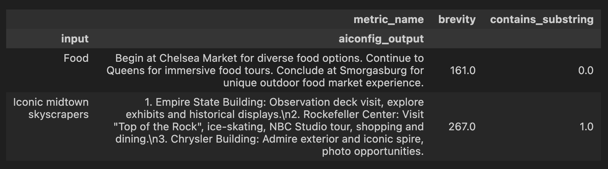
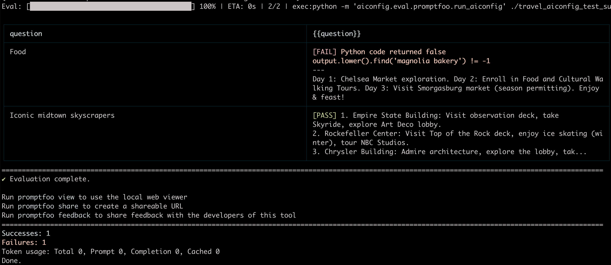

# Tl;Dr

Iterate on AIConfig faster. Measure AIConfig quality improvements and catch regressions. This module is closely related to [Promptfoo](https://www.promptfoo.dev/) and in fact it provides the option to integrate directly with Promptfoo. Please refer to their docs for motivating examples and usage details as needed.

- You specify an AIConfig, test data, and evaluation metrics / assertions.
- Each test case is a pair of (data, evaluation_metric).
- The test data can either be AIConfig _inputs_ or precomputed _outputs_.
- The evaluation metrics can be general, like string length, or have values that depend on the specific test case (like substring match, see example below).
- Metrics are represented as floats, but can represent anything numerical: float/int, or any boolean condition (pass/fail).
- AIConfig eval library runs them through your AIConfig (if necessary) and presents you a table to compare the results. Example:

Inputs:

```
test_inputs_with_substrings = [
    ("Food", "Magnolia Bakery"),
    ("Iconic midtown skyscrapers", "Empire State Building"),
]
# For each input, ask the library to check two things:
- substring match (given the specific paired substring)
- brevity (string length in chars).
...
```

In this case, we have 2 test inputs: "Food" and "Iconic midtown skyscrapers". For each input, we are checking 2 things:
1. Does the output contain a particular substring that we expect it to? This is a boolean metric, very similar to a traditional unit test. 1.0 for pass, 0.0 for fail.
2. Is the output brief enough. The metric is `brevity` which is just string length. Specifically, it's a string -> float function that returns the text's length in characters. This is a numerical metric, not a pass/fail test case.

Output:



# Usage Guide - Custom Eval

## Quick start:

Make sure AIConfig library is installed (pip3 install python-aiconfig).

Usage: Please see [this notebook](https://github.com/lastmile-ai/aiconfig/blob/d79cf7dadf934b0ce09bc671cfde37aaecf05c1e/python/src/aiconfig/eval/custom_eval/examples/travel/travel_eval.ipynb#L4) for an example of running evaluation on an existing AIConfig. Run the notebook cells in order. This should be sufficient to get started, but the sections below provide more detail.

## Custom Eval Usage Steps

Let's take a closer look at what we're testing and how. The travel example linked above is a parametrized AIConfig with the following DAG topology (it is linear in this example):

`the_query -> get_activities.input -> get_activities.output -> gen_itinerary.input -> gen_itinerary.output`.

The leaf "the_query" is the placeholder for test case inputs, like a function argument. The root "gen_itinerary.output" is the value under test. You must specify exactly one leaf input and it must be named "the_query". You must also specify the name of the prompt you want to test (see test suite settings in the example notebook).

Zooming in on the edges, each of which is either prompt string formatting or model execution:

```
the_query -[string formatting]->
  get_activities.input -[get_activities]->
  get_activities.output -[string formatting]->
  gen_itinerary.input -[gen_itinerary]->
  gen_itinerary.output
```

## Evaluate Precomputed Outputs

If you have already run your AIConfig and saved its outputs (either in memory or a data store) you can use the library to evaluate that dataset similar to the way described above. The idea is to define your test cases as

`(output, evaluation_metric)`

instead of

`(input, evaluation_metric)`.

The library will just run your evaluations, skipping the AIConfig inference step. Due to this difference, you do not need to define test suite settings in this case.

See the bottom half of the notebook linked above for a usage example.

# Usage Guide - Promptfoo Integration

If you are already familiar with [Promptfoo](https://www.promptfoo.dev/) and/or prefer to leverage it for your AIConfig evaluation, please follow the steps below. **<u>Some familiarity with Promptfoo is assumed</u>**. Please refer to their documentation as needed.

## Quick start

Please run the example as follows:

`npx promptfoo@latest eval -c python/src/aiconfig/eval/promptfoo/examples/travel/travel_promptfooconfig.yaml`

You should get one passing test and one failing test:



## Promptfoo Usage Steps

This is very similar to the custom eval case, but leverages Promptfoo. The idea is to define an AIConfig as a custom provider that you will specify in your promptfoo file. The AIConfig library contains a run script that appears as a black box to Promptfoo and therefore can easily integrate with Promptfoo as long as you provide a small amount of extra configuration. Essentially, you make a Promptfoo test yaml file with a custom AIConfig provider that points to your test suite settings. Details below.

1. Write your test cases in a Promptfoo config file. ([Example](https://github.com/lastmile-ai/aiconfig/blob/d79cf7dadf934b0ce09bc671cfde37aaecf05c1e/python/src/aiconfig/eval/promptfoo/examples/travel/travel_promptfooconfig.yaml)).

- Note that the `prompts` list must contain one literal prompt (in this case, "question") which is then assigned test values in your Promptfoo test cases (see `vars`). This prompt variable is just a placeholder for Promptfoo's use and is completely distinct from the prompts in your AIConfig. Think of it roughly like a function parameter you need to call the Promptfoo helper function.

2. Define an AIConfig test suite settings file. It must have the name of the AIConfig prompt you want to test and the file path to your aiconfig. ([Example](https://github.com/lastmile-ai/aiconfig/blob/d79cf7dadf934b0ce09bc671cfde37aaecf05c1e/python/src/aiconfig/eval/promptfoo/examples/travel/travel_aiconfig_test_suite_settings.json)).

3. Put one item in `providers` that runs the AIConfig run script with the path to your test suite settings file ([Example](https://github.com/lastmile-ai/aiconfig/blob/d79cf7dadf934b0ce09bc671cfde37aaecf05c1e/python/src/aiconfig/eval/promptfoo/examples/travel/travel_promptfooconfig.yaml#L3)).

4. Make sure your API key(s) are available as environment variables, including to subshell processes. This can be done using `export`. See [here](https://github.com/lastmile-ai/aiconfig/#set-your-openai-api-key) for more detail.

5. Make sure your shell environment (including subshells) contains a python3 executable called `python` on its path. Here are two ways to do this:

- Set up a Python 3 [miniconda environment](https://docs.conda.io/projects/miniconda/en/latest/)
- Set up `pip3` - see "Install Python" [here](https://github.com/lastmile-ai/lastmile/wiki).

6. Run `npx promptfoo@latest eval -c path/to/promptfooconfig.yaml`
   You should see one passing test and one failing test.

### Promptfoo Debugging / Troubleshooting

Help, something went wrong!
-> Try adding --verbose flag at the end of the `npx` command.
