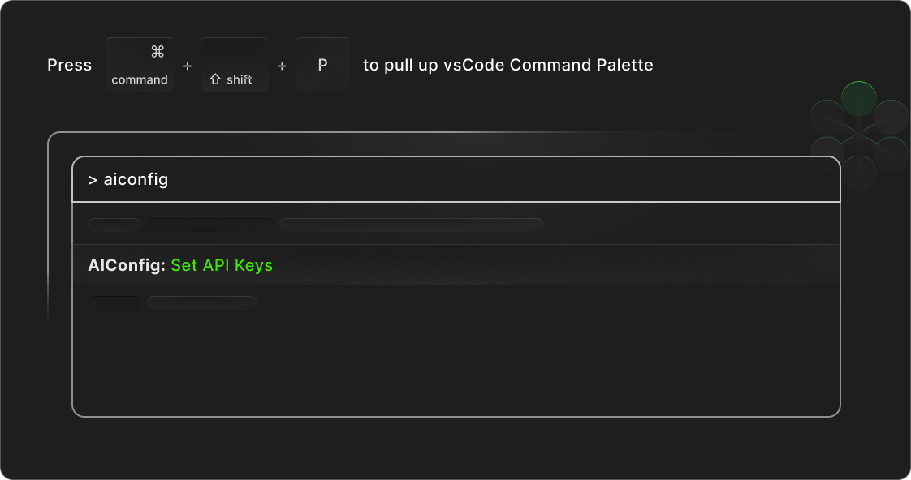

## Set API Keys

> _Tip_: You can use the Command Palette (`CMD/CTRL + Shift + P`) to run the command `AIConfig: Set API Keys`

You can use AIConfig to run models locally (e.g. LLaMA) or via remote inference API (e.g. GPT-4).
For remote inference, some model providers require an API key to access their inference API (e.g. OpenAI, Google, Anthropic).

**[Learn more](https://aiconfig.lastmileai.dev/docs/getting-started#setup-your-api-keys)**

