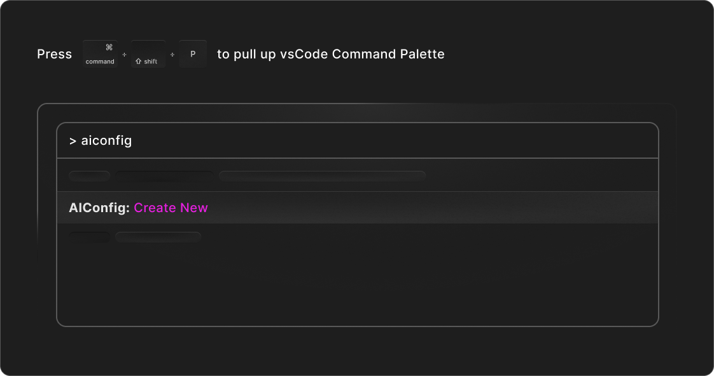

## Create AIConfig

> _Tip_: You can use the Command Palette (`CMD/CTRL + Shift + P`) to run `AIConfig: Create New` to create a new aiconfig anytime.

You can create the aiconfig in JSON or YAML format. The file defines the models, prompts and settings of your AI workflow.

> **Note**: Set the file extension to `*.aiconfig.json` or `*.aiconfig.yaml`. AIConfig Editor will automatically open files with those extensions as a generative AI playground.

**[Learn more](https://aiconfig.lastmileai.dev/docs/editor)**

