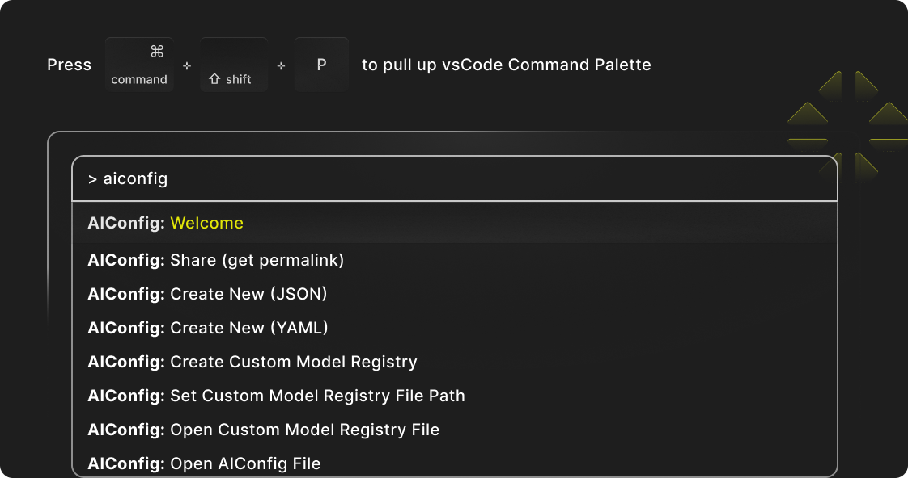

## Find out more!

> _Tip_: Explore all the features of AIConfig Editor by looking for `AIConfig` in the Command Palette (`CMD/CTRL + Shift + P`).

Learn more about generative AI with AIConfig:

- [Features](https://aiconfig.lastmileai.dev/docs/category/overview)
- [Clone aiconfig cookbooks](https://github.com/lastmile-ai/aiconfig/tree/main/cookbooks) (everything from simple playgrounds to complex flows like RAG)
- [Get help on Discord](https://discord.com/invite/xBhNKTetGx)

